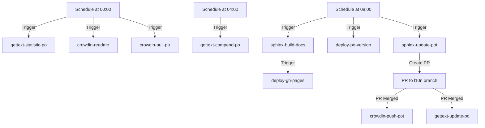
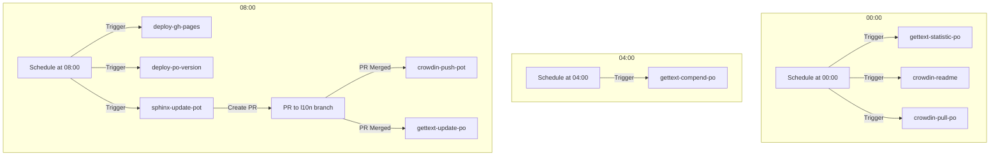
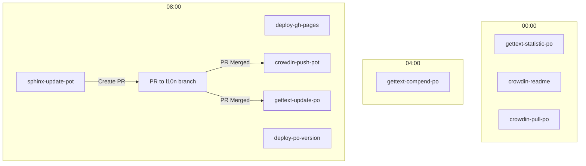

### Plan 1

```mermaid
graph TD
    A[Schedule at 00:00]
    A -->|Trigger| B[gettext-statistic-po]
    A -->|Trigger| C[crowdin-readme]
    A -->|Trigger| D[crowdin-pull-po]

    E[Schedule at 04:00] -->|Trigger| F[gettext-compend-po]

    H[Schedule at 08:00]
    H -->|Trigger| I[sphinx-build-docs] -->|Trigger| J[deploy-gh-pages]
    H -->|Trigger| G[deploy-po-version]
    H -->|Trigger| K[sphinx-update-pot]
    K -->|Create PR| L[PR to l10n branch]
    L -->|PR Merged| M[crowdin-push-pot]
    L -->|PR Merged| N[gettext-update-po]
```

### Plan 2

```mermaid
graph TD
    subgraph 00:00
        A[Schedule at 00:00] -->|Trigger| B[gettext-statistic-po]
        A -->|Trigger| C[crowdin-readme]
        A -->|Trigger| D[crowdin-pull-po]
    end

    subgraph 04:00
        E[Schedule at 04:00] -->|Trigger| F[gettext-compend-po]
    end

    subgraph 08:00
        G[Schedule at 08:00] -->|Trigger| H[deploy-gh-pages]
        G -->|Trigger| I[deploy-po-version]
        G -->|Trigger| J[sphinx-update-pot]

        J -->|Create PR| K[PR to l10n branch]
        K -->|PR Merged| L[crowdin-push-pot]
        K -->|PR Merged| M[gettext-update-po]
    end
```

### Plan 3

```mermaid
graph TD
    subgraph 00:00
        A[gettext-statistic-po]
        B[crowdin-readme]
        C[crowdin-pull-po]
    end

    subgraph 04:00
        D[gettext-compend-po]
    end

    subgraph 08:00
        E[deploy-gh-pages]
        F[deploy-po-version]
        G[sphinx-update-pot]

        G -->|Create PR| H[PR to l10n branch]
        H -->|PR Merged| I[crowdin-push-pot]
        H -->|PR Merged| J[gettext-update-po]
    end
```

